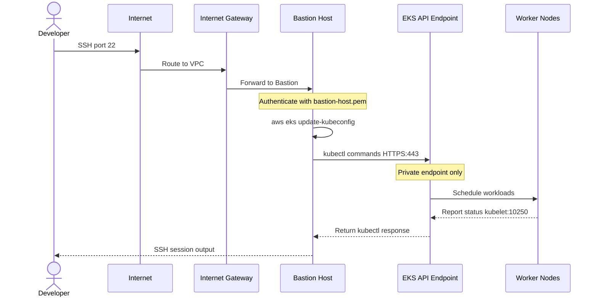

# Sơ đồ cấu trúc hạ tầng AWS EKS

> [!NOTE]
> Sơ đồ này được tạo dựa trên mã Terraform trong thư mục `environments/dev` và các module tương ứng.

## Thông tin tổng quan

| Thuộc tính            | Giá trị                                            |
| --------------------- | -------------------------------------------------- |
| **Project Name**      | KLTN-Project-DEV                                   |
| **AWS Region**        | ap-southeast-1                                     |
| **Cluster Name**      | mlops-infr-dev-eks                                 |
| **K8s Version**       | 1.32                                               |
| **Terraform Backend** | S3 (`kltn-tfstate-dev`) + DynamoDB (`tf-lock-dev`) |

---

## Sơ đồ kiến trúc tổng thể

// Update later

## Sơ đồ networking chi tiết

// Update later

## Sơ đồ security group rules

// Update later

## Sơ đồ terraform module dependencies

// Update later

## Chi tiết các thành phần

### 1. VPC Module

| Resource              | Tên                               | Chi tiết                             |
| --------------------- | --------------------------------- | ------------------------------------ |
| VPC                   | KLTN-Project-DEV-vpc              | CIDR: `10.0.0.0/16`, DNS enabled     |
| Internet Gateway      | KLTN-Project-DEV-igw              | Gắn với VPC                          |
| Public Subnet 1       | KLTN-Project-DEV-public-subnet-1  | `10.0.1.0/24`, Auto-assign public IP |
| Public Subnet 2       | KLTN-Project-DEV-public-subnet-2  | `10.0.2.0/24`, Auto-assign public IP |
| Private Subnet 1      | KLTN-Project-DEV-private-subnet-1 | `10.0.10.0/24`, Worker nodes         |
| Private Subnet 2      | KLTN-Project-DEV-private-subnet-2 | `10.0.20.0/24`, Worker nodes         |
| NAT Gateway 1         | KLTN-Project-DEV-nat-1            | Public Subnet 1 + Elastic IP         |
| NAT Gateway 2         | KLTN-Project-DEV-nat-2            | Public Subnet 2 + Elastic IP         |
| Public Route Table    | KLTN-Project-DEV-public-rt        | `0.0.0.0/0` → Internet Gateway       |
| Private Route Table 1 | KLTN-Project-DEV-private-rt-1     | `0.0.0.0/0` → NAT Gateway 1          |
| Private Route Table 2 | KLTN-Project-DEV-private-rt-2     | `0.0.0.0/0` → NAT Gateway 2          |

> [!TIP]
> Subnets được tag với `kubernetes.io/role/elb` (public) và `kubernetes.io/role/internal-elb` (private) để EKS tự động phát hiện khi tạo Load Balancer.

### 2. Security Group Module

| Security Group       | Ingress Rules                                                                                                                                            | Egress       |
| -------------------- | -------------------------------------------------------------------------------------------------------------------------------------------------------- | ------------ |
| **Control Plane SG** | `443/tcp` từ VPC CIDR + Worker Nodes SG                                                                                                                  | All outbound |
| **Worker Nodes SG**  | `1025-65535/tcp` (ephemeral), `53/udp+tcp` (DNS), `4789/udp` (VXLAN), `30000-32767/tcp` (NodePort), `10250/tcp` (Kubelet từ CP), `443/tcp` (HTTPS từ CP) | All outbound |

### 3. EKS Module

| Resource             | Chi tiết                                                                                  |
| -------------------- | ----------------------------------------------------------------------------------------- |
| **EKS Cluster**      | Name: `mlops-infr-dev-eks`, Version: `1.32`                                               |
| **Endpoint Access**  | Private: Yes / Public: No                                                                 |
| **Cluster Logging**  | api, audit, authenticator, controllerManager, scheduler                                   |
| **Log Retention**    | 7 ngày (CloudWatch)                                                                       |
| **Node Group**       | `mlops-infr-dev-eks-node-group`                                                           |
| **Instance Type**    | `t3.medium` (ON_DEMAND)                                                                   |
| **Scaling**          | Desired: 2, Min: 1, Max: 3                                                                |
| **Launch Template**  | IMDSv2 (required), Custom worker SG attached                                              |
| **Cluster IAM Role** | `AmazonEKSClusterPolicy`, `AmazonEKSVPCResourceController`                                |
| **Node IAM Role**    | `AmazonEKSWorkerNodePolicy`, `AmazonEKS_CNI_Policy`, `AmazonEC2ContainerRegistryReadOnly` |

> [!IMPORTANT]
> EKS API endpoint chỉ truy cập được qua **Private endpoint**. Bạn phải SSH vào Bastion Host trước rồi mới chạy `kubectl` từ đó.

### 4. Bastion Host Module

| Thuộc tính           | Giá trị                           |
| -------------------- | --------------------------------- |
| **Instance Name**    | KLTN-Bastion-Host-v2              |
| **Instance Type**    | t3.micro                          |
| **AMI**              | Ubuntu 22.04 LTS (amd64, HVM-SSD) |
| **Subnet**           | Public Subnet 1 (`10.0.1.0/24`)   |
| **Public IP**        | Auto-assigned                     |
| **SSH Key**          | `bastion-host`                    |
| **Allowed SSH CIDR** | `0.0.0.0/0`                       |

> [!WARNING]
> Bastion Host hiện cho phép SSH từ mọi IP (`0.0.0.0/0`). Nên restrict lại thành IP cụ thể của bạn để tăng bảo mật.

---

## Luồng truy cập EKS Cluster



---

## CI/CD Pipeline - GitHub Actions


**CI Pipeline (`terraform-ci.yml`):**

- `terraform init`
- `terraform validate`
- `terraform plan`
- Upload plan artifact to S3

**Apply Pipeline (`terraform-apply.yml`):**

- Download plan from S3
- `terraform apply` (saved plan)

---

> [!NOTE]
> **Cách kết nối vào cluster:**
>
> ```bash
> # 1. SSH vào Bastion Host
> ssh -i bastion-host.pem ubuntu@<bastion_public_ip>
>
> # 2. Cấu hình kubectl
> aws eks update-kubeconfig --name mlops-infr-dev-eks --region ap-southeast-1
>
> # 3. Kiểm tra nodes
> kubectl get nodes
> ```
