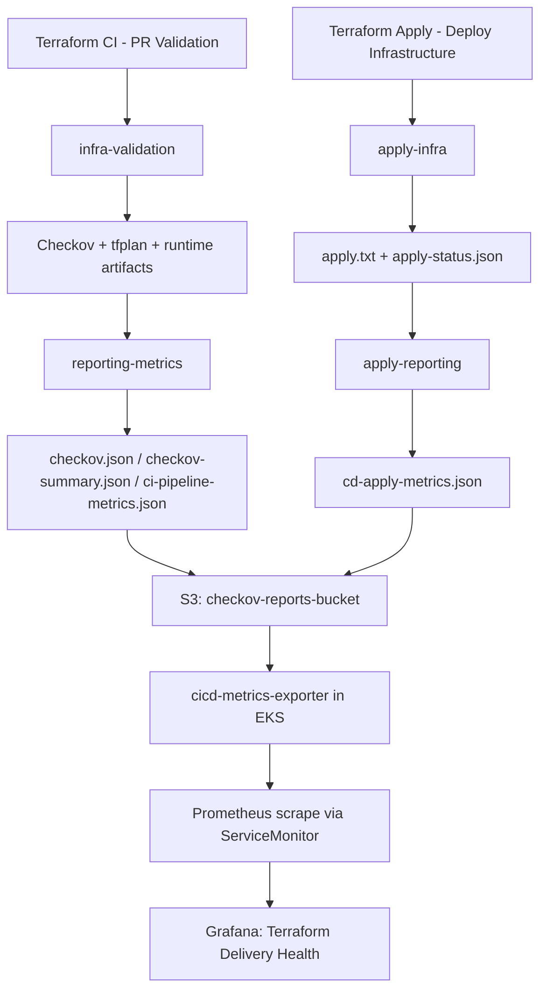

# Terraform Delivery Health

## Mục tiêu

Tài liệu này mô tả quy trình thu thập, lưu trữ và hiển thị metric cho hai luồng chính:

- Terraform CI - PR Validation
- Terraform Apply - Deploy Infrastructure

Thiết kế hiện tại theo hướng:

- CI/CD workflow tạo report JSON có cấu trúc
- Report được lưu tại S3
- Exporter trong EKS đọc report từ S3 và expose metric cho Prometheus
- Grafana hiển thị dashboard hợp nhất Terraform Delivery Health

## Thành phần chính

| Thành phần                  | Vai trò                                                         |
| --------------------------- | --------------------------------------------------------------- |
| `terraform-ci.yml`          | Chạy kiểm tra hạ tầng, Checkov, tạo `ci-pipeline-metrics.json`  |
| `terraform-apply.yml`       | Chạy apply thật, tạo `cd-apply-metrics.json` và lưu `apply.txt` |
| `checkov-reports-bucket`    | Nơi lưu report gốc và log để audit/debug                        |
| `cicd-metrics-exporter`     | Đọc report từ S3, tổng hợp và expose Prometheus metrics         |
| `ServiceMonitor`            | Cho Prometheus scrape exporter                                  |
| `Terraform Delivery Health` | Dashboard Grafana gộp theo 3 section `Overview`, `CI`, `CD`     |

## Luồng tổng thể



## Luồng Terraform CI

Workflow: [`.github/workflows/terraform-ci.yml`](../../.github/workflows/terraform-ci.yml)

### Job 1: `infra-validation`

Chịu trách nhiệm chạy các bước blocking của CI:

- terraform init
- import các resource đang tồn tại
- terraform fmt
- terraform validate
- terraform plan
- checkov

Kết quả đầu ra của job này:

- plan.txt
- tfplan
- checkov-cli.log
- checkov.json
- checkov.junit.xml
- status snapshot của từng step

### Job 2: `reporting-metrics`

Job này luôn chạy để tổng hợp báo cáo và metric:

- Tạo `checkov-summary.json`
- Tạo `ci-pipeline-metrics.json`
- Upload report lên `S3`
- Upload `checkov.junit.xml` làm GitHub artifact
- Ghi `GitHub Step Summary`
- Tạo comment riêng cho Terraform và Checkov trên PR

### Các file CI được lưu trên S3

Prefix:

```text
s3://checkov-reports-bucket/terraform-ci/<environment>/sha=<sha>/run-id=<run_id>/attempt=<run_attempt>/
```

File chính:

- checkov-cli.log
- checkov.json
- checkov-summary.json
- ci-pipeline-metrics.json

## Luồng Terraform Apply

Workflow: [`.github/workflows/terraform-apply.yml`](../../.github/workflows/terraform-apply.yml)

### Job 1: `apply-infra`

Chịu trách nhiệm chạy apply thật:

- Branch guard
- `terraform init`
- Tải `tfplan` từ S3 theo `plan_commit_sha`
- Verify `tfplan`
- Import resource nếu cần
- `terraform apply`

Kết quả đầu ra của job này:

- `apply.txt`
- `apply-status.json`
- status snapshot của từng step apply

### Job 2: `apply-reporting`

Job này chạy để tổng hợp báo cáo triển khai:

- Tạo `cd-apply-metrics.json`
- Upload `apply.txt` và `apply-status.json` lên `S3`
- Ghi `GitHub Step Summary`
- Tạo issue cảnh báo nếu apply fail

### Các file Apply được lưu trên S3

Prefix:

```text
s3://checkov-reports-bucket/terraform-apply/<environment>/sha=<plan_commit_sha>/run-id=<run_id>/attempt=<run_attempt>/
```

File chính:

- apply.txt
- apply-status.json
- cd-apply-metrics.json

## Metric được exporter expose

Exporter: [`modules/monitoring/cicd-metrics/exporter.py`](../../modules/monitoring/cicd-metrics/exporter.py)

Metric chung:

- `cicd_pipeline_runs_total`
- `cicd_pipeline_failed_runs_total`
- `cicd_pipeline_success_rate`
- `cicd_pipeline_execution_time_seconds`
- `cicd_pipeline_last_run_success`
- `cicd_pipeline_last_run_timestamp_seconds`

Metric riêng cho CI:

- `cicd_automated_test_pass_rate`
- `cicd_checkov_failed_checks`

Metric riêng cho CD Apply:

- `cicd_plan_age_seconds`

Label chính:

- `repository`
- `workflow`
- `branch`
- `window`
- `stat`

## Triển khai exporter vào EKS

Các manifest và Terraform liên quan:

- [`modules/monitoring/cicd-metrics/main.tf`](../../modules/monitoring/cicd-metrics/main.tf)
- [`modules/monitoring/cicd-metrics/manifests/serviceaccount.yaml.tpl`](../../modules/monitoring/cicd-metrics/manifests/serviceaccount.yaml.tpl)
- [`modules/monitoring/cicd-metrics/manifests/deployment.yaml.tpl`](../../modules/monitoring/cicd-metrics/manifests/deployment.yaml.tpl)
- [`modules/monitoring/cicd-metrics/manifests/service.yaml`](../../modules/monitoring/cicd-metrics/manifests/service.yaml)
- [`modules/monitoring/cicd-metrics/manifests/servicemonitor.yaml`](../../modules/monitoring/cicd-metrics/manifests/servicemonitor.yaml)
- [`.github/scripts/bash/phase2-install-addons.sh`](../../.github/scripts/bash/phase2-install-addons.sh)

Luồng triển khai:

- Terraform tạo `IRSA role` để exporter đọc `S3`
- bootstrap script render manifest với prefix cho cả `terraform-ci` và `terraform-apply`
- pod exporter sync report từ `S3` về local volume
- Prometheus scrape exporter qua `ServiceMonitor`

## Dashboard Grafana

Dashboard: [`modules/monitoring/grafana/dashboards/cicd-pipeline-health.json`](../../modules/monitoring/grafana/dashboards/cicd-pipeline-health.json)

Tên dashboard:

- `Terraform Delivery Health`

### Section 1: `Overview`

Chứa metric tổng quan để nhìn nhanh sức khỏe delivery:

- CI Success Rate
- CD Apply Success Rate
- Latest CI Duration
- Latest CD Duration
- CI Test Pass Rate
- Latest Plan Age
- Failed CI Runs
- Failed CD Runs

### Section 2: `CI`

Chỉ hiển thị metric riêng của Terraform CI:

- success rate
- automated test pass rate
- p95 execution time
- last CI run status
- latest failed Checkov checks

### Section 3: `CD`

Chỉ hiển thị metric riêng của Terraform Apply:

- success rate
- p95 apply duration
- p95 plan age
- last apply status
- latest plan age by branch
- failed apply runs

## Quy ước quan trọng

- Dashboard đang match theo đúng workflow name hiện tại:
  - `Terraform CI - PR Validation`
  - `Terraform Apply - Deploy Infrastructure`
- Nếu đổi tên workflow trong GitHub Actions, cần sửa lại query trong dashboard.
- `Checkov` là advisory trong CI, không tự động làm đỏ toàn bộ pipeline nếu chỉ có finding.
- `plan age` chỉ có ý nghĩa cho CD Apply, không dùng cho CI.

## Trình tự vận hành sau khi thay đổi code

1. Chạy `terraform apply` cho môi trường để tạo hoặc cập nhật `IRSA` của exporter.
2. Chạy lại bootstrap monitoring để apply manifest exporter và dashboard mới.
3. Chạy `Terraform CI` ít nhất một lần để tạo `ci-pipeline-metrics.json`.
4. Chạy `Terraform Apply` ít nhất một lần để tạo `cd-apply-metrics.json`.
5. Mở Grafana và kiểm tra dashboard `Terraform Delivery Health`.
