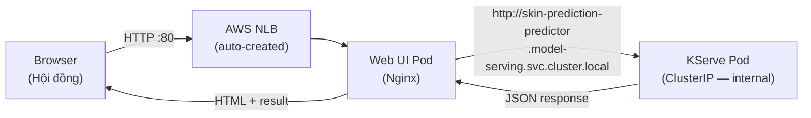

# Giao diện website dùng để chẩn đoán ung thư da

## Kiến trúc tổng quan



> [!IMPORTANT]
> **Model endpoint giữ internal (ClusterIP)**, không expose trực tiếp ra internet.
> Web UI gọi model qua **K8s internal DNS**, đảm bảo bảo mật.

## User Review Required

> [!WARNING]
> **CORS vấn đề**: Browser gọi `NLB_IP:80` (Web UI), nhưng Web UI cần proxy request tới KServe (internal). Có 2 cách:
>
> - **(A) Nginx reverse proxy** (khuyến nghị): Nginx serve static files + proxy `/api/` tới KServe pod. Browser chỉ gọi 1 domain → không CORS.
> - **(B) Client-side fetch**: Browser gọi thẳng KServe → bị CORS vì khác domain.
>
> Plan này dùng **Cách A - Nginx reverse proxy**.

## Proposed Changes

### Cấu trúc thư mục sau khi hoàn thành

```
src/
├── model-serving/              # (đã có - không thay đổi)
│   ├── Dockerfile
│   ├── requirements.txt
│   └── serving.py
└── web-ui/                     # (MỚI)
    ├── Dockerfile              # Nginx + static files
    ├── nginx.conf              # Reverse proxy config
    ├── index.html              # Trang chính
    ├── styles.css              # Dark theme, medical aesthetic
    └── app.js                  # Logic upload + gọi API

gitops/
├── model-serving/              # (đã có - không thay đổi)
│   └── inference-service.yaml
├── web-ui/                     # (MỚI)
│   ├── deployment.yaml         # Deployment + Service (NLB)
│   └── configmap-nginx.yaml    # Nginx config as ConfigMap (optional)
└── apps/
    ├── multimodal-serving.yaml # (đã có)
    └── web-ui.yaml             # (MỚI) ArgoCD Application

.github/workflows/
├── model-serving.yml           # (đã có — không thay đổi)
└── web-ui.yml                  # (MỚI) CI/CD for Web UI
```

---

### Component 1: Web UI Source — `src/web-ui/`

#### [NEW] [nginx.conf](file:///d:/mlops-infr/src/web-ui/nginx.conf)

Nginx config vừa serve static files vừa reverse proxy API:

```nginx
server {
    listen 80;

    # Serve Web UI (static files)
    location / {
        root /usr/share/nginx/html;
        index index.html;
    }

    # Proxy API requests → KServe pod (internal)
    location /api/ {
        proxy_pass http://skin-prediction-predictor.model-serving.svc.cluster.local/;
        proxy_set_header Host $host;
        proxy_read_timeout 120s;   # model inference có thể chậm lần đầu
    }
}
```

Browser gọi:

- `GET /` → Nginx trả HTML/CSS/JS
- `POST /api/v1/models/skin-prediction:predict` → Nginx proxy tới KServe pod

→ **Không CORS** vì cùng domain.

#### [NEW] [index.html](file:///d:/mlops-infr/src/web-ui/index.html)

Trang chính, bao gồm:

| Section                  | Mô tả                                                                                                |
| ------------------------ | ---------------------------------------------------------------------------------------------------- |
| **Header**               | Logo + tiêu đề "Skin Lesion Prediction — ISIC 2024"                                                  |
| **Upload ảnh**           | Drag-and-drop hoặc chọn file. Preview ảnh. Auto convert base64                                       |
| **Thông tin lâm sàng**   | Form nhập tabular — chia 2 nhóm:                                                                     |
| — Nhóm 1 (luôn hiển thị) | `age_approx`, `sex`, `anatom_site_general`, `clin_size_long_diam_mm`, `tbp_lv_dnn_lesion_confidence` |
| — Nhóm 2 (accordion)     | 32 cột TBP còn lại (nhập số, để trống = imputer fill median)                                         |
| **API Config**           | URL mặc định `/api` (relative), nút "Kiểm tra kết nối"                                               |
| **Kết quả**              | Label (Benign/Malignant) + probability bar + inference time                                          |
| **Lịch sử**              | Bảng ghi lại các lần test trước (in-memory)                                                          |

#### [NEW] [styles.css](file:///d:/mlops-infr/src/web-ui/styles.css)

Dark theme, medical/clinical aesthetic:

- Dark background (#0f172a) + gradient accents (teal/cyan)
- Card-based layout, glassmorphism
- Benign → xanh lá (#22c55e), Malignant → đỏ (#ef4444)
- Animated probability gauge
- Responsive (mobile cho demo trên điện thoại)
- Google Font: Inter

#### [NEW] [app.js](file:///d:/mlops-infr/src/web-ui/app.js)

Logic JavaScript:

- Drag-and-drop + file input → `FileReader` → base64
- Đọc form → build `tabular_raw` dict (bỏ qua field rỗng)
- Health check: `GET /api/v1/models/skin-prediction`
- Predict: `POST /api/v1/models/skin-prediction:predict`
- Parse response → hiển thị kết quả với animation
- Lịch sử dự đoán (in-memory array, render table)
- Error handling

#### [NEW] [Dockerfile](file:///d:/mlops-infr/src/web-ui/Dockerfile)

```dockerfile
FROM nginx:1.25-alpine
COPY nginx.conf /etc/nginx/conf.d/default.conf
COPY index.html styles.css app.js /usr/share/nginx/html/
EXPOSE 80
```

Image ~25MB, khởi động <1s.

---

### Component 2: K8s Manifests — `gitops/web-ui/`

#### [NEW] [deployment.yaml](file:///d:/mlops-infr/gitops/web-ui/deployment.yaml)

```yaml
apiVersion: apps/v1
kind: Deployment
metadata:
    name: web-ui
    namespace: model-serving # cùng namespace với KServe
spec:
    replicas: 1
    selector:
        matchLabels:
            app: web-ui
    template:
        spec:
            containers:
                - name: nginx
                  image: <ECR_REGISTRY>/skin-prediction-web-ui:<TAG>
                  ports:
                      - containerPort: 80
                  resources:
                      requests: { cpu: 50m, memory: 64Mi }
                      limits: { cpu: 200m, memory: 128Mi }
---
apiVersion: v1
kind: Service
metadata:
    name: web-ui
    namespace: model-serving
    annotations:
        service.beta.kubernetes.io/aws-load-balancer-type: "nlb"
        service.beta.kubernetes.io/aws-load-balancer-scheme: "internet-facing"
spec:
    type: LoadBalancer
    selector:
        app: web-ui
    ports:
        - port: 80
          targetPort: 80
```

**NLB trỏ đúng pod**: Service selector `app: web-ui` → match Deployment labels.

---

### Component 3: ArgoCD Application — `gitops/apps/web-ui.yaml`

#### [NEW] [web-ui.yaml](file:///d:/mlops-infr/gitops/apps/web-ui.yaml)

```yaml
apiVersion: argoproj.io/v1alpha1
kind: Application
metadata:
    name: web-ui
    namespace: argocd
    annotations:
        argocd.argoproj.io/sync-wave: "4" # sau model-serving (wave 3)
spec:
    project: platform
    source:
        repoURL: https://github.com/xyan-dhgb/mlops-infrastructure.git
        targetRevision: dev
        path: gitops/web-ui
    destination:
        server: https://kubernetes.default.svc
        namespace: model-serving
    syncPolicy:
        automated:
            selfHeal: true
        syncOptions:
            - CreateNamespace=true
```

Push lên Git → ArgoCD tự sync → NLB tự tạo → có URL ngay.

---

### Component 4: CI/CD — `.github/workflows/web-ui.yml`

#### [NEW] [web-ui.yml](file:///d:/mlops-infr/.github/workflows/web-ui.yml)

Workflow tương tự `model-serving.yml`:

| Step          | Mô tả                                               |
| ------------- | --------------------------------------------------- |
| Trigger       | PR merged vào `dev`, paths: `src/web-ui/**`         |
| Build         | `docker build src/web-ui/`                          |
| Push          | Push lên ECR `skin-prediction-web-ui:<tag>`         |
| Update GitOps | Patch image tag vào `gitops/web-ui/deployment.yaml` |
| ArgoCD sync   | Tự động                                             |

## Verification Plan

### Automated Tests

```bash
# Health check Web UI
curl http://<NLB-DNS>/

# Health check API (qua proxy)
curl http://<NLB-DNS>/api/v1/models/skin-prediction

# Predict (qua proxy)
curl -X POST http://<NLB-DNS>/api/v1/models/skin-prediction:predict \
  -H "Content-Type: application/json" \
  -d '{"instances":[{"image":"<base64>","tabular_raw":{}}]}'
```

### Manual Verification

1. Mở browser → `http://<NLB-DNS>`
2. Upload ảnh ISIC_0104229 + nhập tabular đúng → Dự đoán → Malignant
3. Upload ảnh Benign + nhập tabular đúng → Dự đoán → Benign
4. Kiểm tra lịch sử dự đoán hiển thị đúng
5. Test responsive trên mobile
