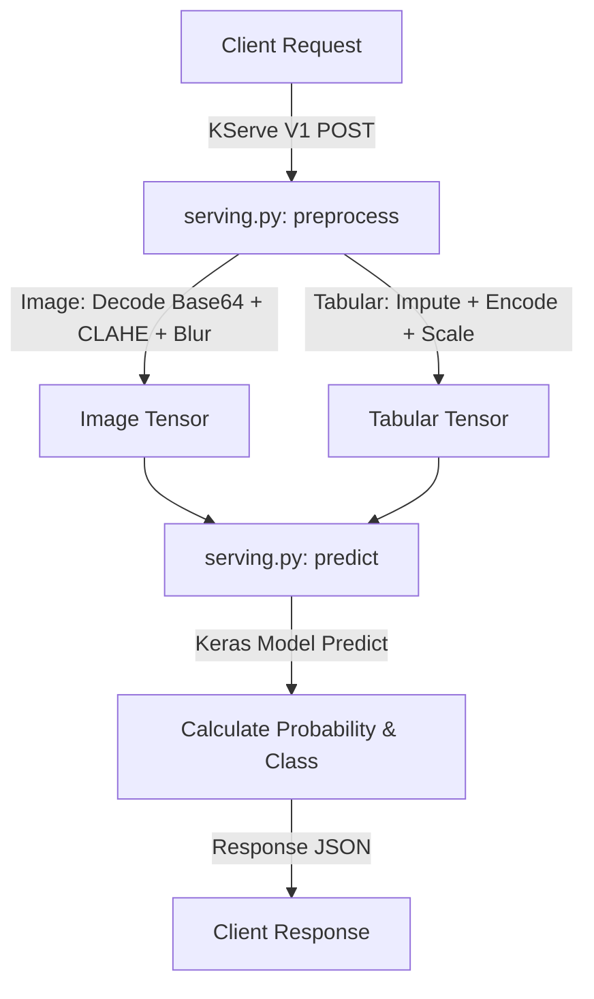

# KServe Custom Service Predict

- Thư mục này chứa mã nguồn của các dịch vụ chạy trong hạ tầng MLOps. Các dịch vụ này được đóng gói dưới dạng Docker image và triển khai trên cụm Kubernetes thông qua KServe hoặc Knative.

## Các thành phần

Hiện tại, thư mục `src` bao gồm thành phần chính sau:

### 1. [model-serving](/src/model-serving/)

Dịch vụ phục vụ mô hình (Model Serving) dự đoán ung thư da (`skin-prediction`) sử dụng framework KServe.

- **[serving.py](/src/model-serving/serving.py)**:
    - Triển khai bộ dự đoán tùy chỉnh (Custom Predictor) kế thừa lớp `kserve.Model`.
    - Hỗ trợ chuẩn giao thức **KServe V1 protocol** (endpoint `/v1/models/skin-prediction:predict`).
    - Thực hiện tiền xử lý dữ liệu đầu vào đa phương thức (Multimodal):
        - **Hình ảnh (Image)**: Giải mã Base64, chuyển đổi về kích thước `224x224`, áp dụng thuật toán CLAHE để cân bằng độ tương phản màu sắc, làm mịn bằng Gaussian Blur và tăng độ tương phản (Contrast x1.2).
        - **Dữ liệu bảng (Tabular)**: Điền giá trị thiếu (Imputation), mã hóa nhãn (Label Encoding), và chuẩn hóa dữ liệu (Standard Scaling) sử dụng file tiền xử lý `encoders.pkl` được trích xuất từ quá trình huấn luyện mô hình.
    - Tải mô hình Keras (`best_model_isic2024.h5`), bộ tiền xử lý và ngưỡng quyết định (`best_threshold.txt`) tự động từ Object Storage (S3/MinIO) thông qua KServe Storage Initializer.
- **[Dockerfile](/src/model-serving/Dockerfile)**:
    - Dockerfile tối ưu hóa dựa trên image `python:3.10-slim`.
    - Cài đặt các thư viện hệ thống cần thiết cho OpenCV headless (`libgl1`, `libglib2.0-0`, v.v.) và Pillow.
    - Đóng gói mã nguồn predictor và thiết lập cổng mặc định `8080` cho KServe.
- **[requirements.txt](/src/model-serving/requirements.txt)**:
    - Khai báo các gói thư viện Python cần thiết như `kserve`, `tensorflow-cpu` (dùng CPU để tối ưu hóa chi phí phục vụ mô hình), `tf-keras`, `scikit-learn`, `opencv-python-headless`, và `Pillow`.

## Luồng hoạt động



## Giao thức Truy cập (API Protocol)

### Định dạng Request (KServe V1)

```json
{
    "instances": [
        {
            "image": "<chuỗi_base64_của_ảnh_JPEG_hoặc_PNG>",
            "tabular_raw": {
                "age_approx": 45,
                "sex": "male",
                "anatom_site_general": "anterior torso"
            }
        }
    ]
}
```

### Định dạng Response

```json
{
  "predictions": [{
    "label": "Malignant" | "Benign",
    "probability": 0.8341,
    "inference_ms": 120.5
  }]
}
```
